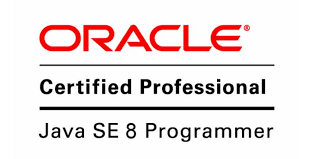

Hi 👋 My name is Sandeep Kunusoth
=================================

Full Stack Developer
--------------------

I am a highly skilled Full Stack Mobile and Web Developer with over 4 years of experience. Throughout my career, I have been involved in all stages of the Software Development Life Cycle (SDLC) and have a strong background in Agile/Scrum methodologies. I am committed to staying updated with the latest trends and advancements in the technology industry. Proficient in version control tools like Git and SVN, as well as project management tools like JIRA, I am well-equipped to handle complex development projects. Additionally, I have hands-on experience with various AWS services, including API Gateway, Lambda, SQS, S3, CloudFormation, CloudWatch, and Cognito. My expertise includes understanding requirements, technical design, refactoring, continuous integration, unit testing, and automated testing.

  

* 🌍  I'm based in New York
* ✉️  You can contact me at [skunusot@buffalo.edu](mailto:skunusot@buffalo.edu)

### Skills

### Badges
<!--

  

  
  

  

  

  

-->

  

  

  

  

## My GitHub Stats

<!--

-->

## Leetcode Stats

  
## Socials

